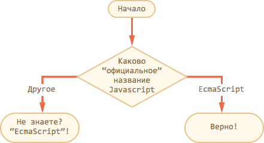

importance: 2

---

# Проверка стандарта

Используя конструкцию `if..else`, напишите код, который будет спрашивать: "Каково "официальное" название JavaScript?".

Если посетитель вводит "ECMAScript", то выводить "Верно!", если что-то другое -- выводить "Не знаете? "ECMAScript"!".

Блок-схема:

[demo src="ifelse_task2"]
